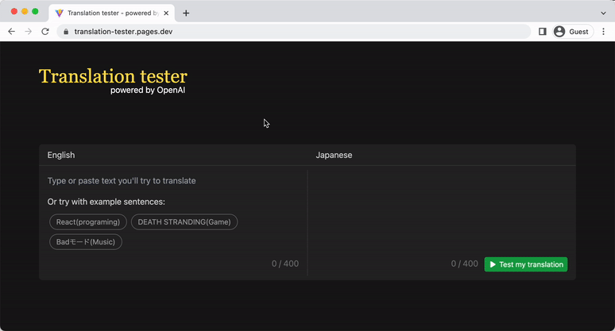

# Translation test

Testing whether your translation is correct or incorrect by OpenAI.

https://translation-tester.pages.dev/

## Demo

Introduction of react:

"Badモード"(the album by Hikaru Utada) review:

# Motivation

I'm a software engineer in Japan, and I'm studying English.

I try to read articles or videos in English to know that software engineers use words and phrases. But I had a problem in that I could not remember words and phrases well. 

I think the best way to remember it is practice over and over again so I looked for tools. But I could not find the right one so I created this one.

<!--
私は日本に住んでいるエンジニアで英語を勉強しています。
英語圏で使われている表現や単語を知るために、英語のブログやプレゼンテーション、ツイートを見ているのですが、なかなか記憶に定着しないことに課題を感じていました。

記憶に定着させるには反復練習が一番だと思うので、そのためのツールを探したのですがちょうどいいものが見つからなかったので作りました。
-->

# Contribution

I'm trying to manage this product development using [Linear](https://linear.app/) so GitHub Issue is disabled.

If you find a bug or have a feature request, please use a [Discussions](https://github.com/toyamarinyon/translation-tester/discussions).
